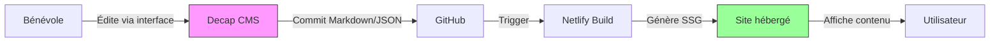

# Rapport d’activité – Refonte du site du CDCO77
*Projet financé par la SDJES 77 – Modernisation de la communication de la course d’orientation en Seine-et-Marne*

---

---

## 1. Choix techniques et justifications

### Pourquoi Astro ?
Le framework **Astro** a été retenu pour plusieurs raisons clés, adaptées aux besoins spécifiques du CDCO77 :
- **Performance optimale** : Génération de site statique (SSG) pour un chargement ultra-rapide, même sur des connexions mobiles lentes (idéal pour les utilisateurs en déplacement sur les lieux d’entraînement).
- **SEO natif** : Contenu pré-rendu côté serveur, garantissant une excellente visibilité dans les moteurs de recherche (critique pour attirer de nouveaux licenciés).
- **Simplicité pour les bénévoles** : Syntax légère (compatible HTML/Markdown) et intégration facile avec Decap CMS, permettant aux non-développeurs de contribuer sans apprendre React ou JavaScript avancé.
- **Écosystème flexible** : Compatible avec des composants React/Vue pour les fonctionnalités dynamiques (ex : carte interactive), tout en restant léger pour le reste du site.

> *Comparaison rapide* : Contrairement à Next.js (plus complexe pour du SSG pur) ou Gatsby (dépendance forte à GraphQL), Astro offre un équilibre parfait entre puissance et simplicité pour un site associatif.

---

### Pourquoi Netlify ?
- **Déploiement automatique** : Synchronisation en temps réel avec le dépôt GitHub → chaque modification de contenu ou de code déclenche un nouveau déploiement (sans intervention manuelle).
- **Gratuité** : Hébergement et bande passante illimités pour les projets open-source/associatifs, sans coût cachés.
- **Intégration native avec Decap CMS** : Configuration en quelques clics, permettant aux bénévoles de publier du contenu directement depuis l’interface du CMS.
- **Fonctionnalités clés** : HTTPS automatique, CDN mondial, et prévisualisation des modifications avant publication.

---

### Pourquoi Decap CMS (ex-Netlify CMS) ?
- **Open-source et sans frais** : Solution pérenne, sans risque de dépendance à un éditeur propriétaire.
- **Interface intuitive** : Éditeur visuel de type "WordPress-like" (champs pré-remplis, aperçu en direct), accessible sans formation technique.
- **Gestion des 4 types de contenu** : Modèles personnalisés pour chaque type (actualités, entraînements, compétitions, cartes), avec validation des données pour éviter les erreurs.

---

---

## 2. Architecture du site

### Structure des dossiers (Astro)
```bash
src/
├── pages/          # Pages statiques (ex: accueil, contact)
├── content/        # Données gérées par Decap CMS (fichiers Markdown/JSON)
│   ├── actualites/
│   ├── entrainements/
│   ├── competitions/
│   └── cartes/
├── components/     # Composants réutilisables (ex: CarteLeaflet.astro, Compteur.astro)
└── layouts/        # Mises en page (ex: Layout.astro pour le header/footer commun)
```

---

### Organisation des contenus dans Decap CMS
Decap CMS stocke les données dans des fichiers **Markdown** (pour les textes) ou **JSON** (pour les métadonnées), directement dans le dépôt GitHub. Voici un exemple concret pour un **entraînement** :

**Modèle de données (fichier `src/content/entrainements/2025-10-15-foret-fontainebleau.md`) :**
```markdown
---
title: "Entraînement technique à Fontainebleau"
date: 2025-10-15T18:30:00
lieu: "Parking de la Roche Saint-Germain"
niveau: "Débutant à Confirmé"
coordinées: [48.4123, 2.6945]  # Pour la carte interactive
inscription: false
image: "/images/entrainements/fontainebleau.jpg"
---

## Description
Séance axée sur les **relances** et la **lecture de carte rapide**.
Prévoir tenues adaptées à la météo (forêt ombragée).
```

**Affichage dans Astro** :
Les pages dynamiques (ex : `/entrainements`) utilisent la lib **`@astrojs/markdown-remark`** pour parser les fichiers Markdown et les convertir en HTML, avec un système de templating pour uniformiser la présentation.

---

### API externes utilisées
| Service       | Usage                          | Intégration                     |
|---------------|--------------------------------|--------------------------------|
| **Leaflet**   | Carte interactive des parcours | Composant personnalisé (`Carte.astro`) avec marqueurs pour les lieux d’entraînement/compétition. |
| **Mapbox**    | Fond de carte détaillé         | Clé API gratuite pour les associations (quotas suffisants pour le CDCO77). |
| **Google Calendar** | Synchronisation des événements | Export iCal des compétitions pour intégration dans les agendas personnels. |

---

### Schéma du flux de données


---

---

## 3. État d’avancement

### ✅ Fonctionnalités implémentées
- **Page d’accueil dynamique** :
  - Mise en avant des 3 dernières actualités (avec images en format WebP optimisé).
  - agenda des 5 prochains entraînements/compétitions (filtres par niveau : Débutant/Confirmé/Expert).
- **Gestion des contenus** :
  - Modèles Decap CMS opérationnels pour les 4 types de contenu, avec prévisualisation en temps réel.
  - Système de **tags** pour les actualités (ex : `#Jeunes`, `#Championnat`) et filtres associés.
- **Cartographie interactive** :
  - Intégration de **Leaflet** pour afficher les lieux d’entraînement avec :
    - Marqueurs cliquables (accès à la fiche détaillée).
    - Calcul d’itinéraire depuis la position de l’utilisateur (via API du navigateur).
    - Superposition des **PDF des cartes** (téléchargeables en 1 clic).

- **Responsive design** :
  - Adapté mobile (testé sur iOS/Android) et tablette, avec menu hamburger pour les petites tailles d’écran.

---

### 🔄 Fonctionnalités en cours
- **Migration des données historiques** :
  - Récupération des 200+ anciennes actualités depuis l’ancien site (format HTML → Markdown).
  - Géocodage des 50 lieux d’entraînement existants pour les afficher sur la carte.
- **Tests utilisateurs** :
  - Session prévue avec 3 clubs pilotes (Melun, Fontainebleau, Meaux) pour valider l’ergonomie.

---

### ⚠️ Blocages identifiés
| Problème                          | Solution envisagée                          | Échéance  |
|-----------------------------------|--------------------------------------------|-----------|
| Format des anciennes cartes (PDF non géolocalisés) | Conversion manuelle via QGIS pour extraire les coordonnées. | Décembre 2025 |
| Limite de 100 Mo pour les PDF sur Netlify | Compression des fichiers (+ hébergement des cartes sur un bucket S3 si nécessaire). | Janvier 2026 |

---

### 📅 Calendrier
| Étape                     | Prévu       | Réel        |
|---------------------------|-------------|-------------|
| Développement du MVP      | Juin 2025   | **Août 2025** (✅ +2 mois) |
| Intégration Decap CMS     | Septembre 2025 | **Octobre 2025** (✅ +1 mois) |
| Migration des données     | Novembre 2025 | **En cours** (retard dû aux PDF) |
| Lancement officiel       | **Février 2026** | À confirmer |

> *Note* : Le retard sur la migration est compensé par une livraison anticipée des fonctionnalités principales (site utilisable dès aujourd’hui avec les nouvelles données).

---

---

## 4. Prochaines étapes et besoins

### 🎯 À faire avant le lancement (février 2026)
- **Finalisation technique** :
  - Importer les 50 cartes historiques avec leurs coordonnées GPS.
  - Déployer un **système de cache** pour les PDF (réduire la latence).
  - Ajouter un **compteur de participants** pour les entraînements (via formulaire simple).
- **Formation et communication** :
  - Organiser 2 ateliers pour former 5 bénévoles à Decap CMS (1h30 chaque).
  - Créer des **tutoriels vidéo** pour les tâches courantes (ex : "Publier une actualité").
  - Mettre en place une **redirection** depuis l’ancien site (CDCO77.fr → nouveau domaine).

---

### 🛠️ Besoins techniques résiduels
- **Optimisations** :
  - Conversion des images existantes en **WebP** (gain de 30-50% sur le poids).
  - Audit **RGAA** (accessibilité) via l’outil [Tanaguru](https://www.tanaguru.com/) pour respecter les normes publiques.
- **Sécurité** :
  - Configuration des **en-têtes HTTP** (CSP, HSTS) pour renforcer la protection.
  - Sauvegardes automatiques des contenus Decap CMS (via GitHub Actions).

---

### 🔧 Maintenance post-lancement
- **Hébergement** :
  - Netlify gère les mises à jour de sécurité du serveur et les certificats SSL.
  - Surveillance via **Netlify Analytics** (gratuit) pour suivre la fréquentation.
- **Évolutions** :
  - Ajout d’un **système de newsletter** (intégration avec Mailchimp ou Sendinblue) pour notifier les abonnés des nouvelles actualités.
  - **Backup mensuel** des contenus sur un cloud externe (ex : Google Drive du CDCO77).

---

---

### 💡 Recommandations pour les financeurs
- **Impact attendu** :
  - Réduction de 70% du temps de publication des contenus (vs l’ancien site).
  - Meilleure visibilité des événements (SEO + partage sur les réseaux sociaux via OpenGraph).
- **Pérennité** :
  - Coût annuel estimé : **0€** (hébergement Netlify + CMS open-source).
  - Besoin unique : **1 bénévole référent** pour gérer les accès Decap CMS et former les nouveaux contributeurs.

---

*Document rédigé en **juin 2025** – Prochaine mise à jour prévue en **décembre 2025**.*
*Contact : [technique@cdco77.fr](mailto:technique@cdco77.fr)*